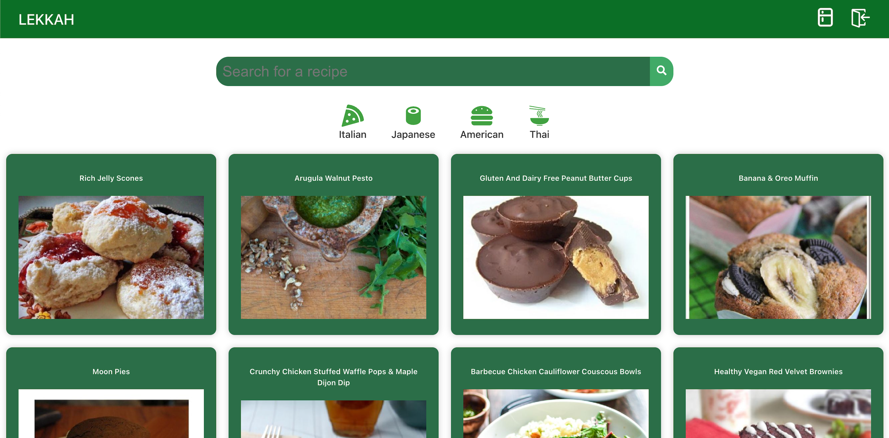

# Lekkah - Recepten zoekapplicatie



Lekkah is een eenvoudige website waarmee gebruikers recepten kunnen zoeken en ontdekken. Het is bedoeld personen 
te helpen bij het vinden van inspirerende recepten en maaltijdideeën.

## Inhoudsopgave
- [Inleiding](#inleiding)
- [Functies](#functies)
- [Installatie](#installatie)
- [Gebruik](#gebruik)
- [Standaard gebruikers](#standaard-gebruikers)

## Inleiding

Lekkah is ontwikkeld als eindopdracht voor de leerlijn Front-end van Hogeschool Novi. De website is gemaakt om personen 
te helpen bij het vinden van recepten en maaltijdideeën. De app maakt gebruik van een receptendatabase genaamd Spoonacular
en biedt handige zoek- en filtermogelijkheden om snel het gewenste recept te vinden. 

## Functies

- Blader door een uitgebreide verzameling van recepten.
- Zoek specifieke recept door gebruik te maken van de zoekbalk.
- Filter recepten op ingrediënten.
- Filter recepten op keuken types.
- Bekijk gedetailleerde receptinformatie, inclusief ingrediëntenlijst en bereidingsinstructies.
- Login en maak een boodschappenlijst met de nodige ingrediënten.
- Eenvoudig te gebruiken met een vrolijke gebruikersinterface.

## Installatie

### Vereisten

- [Node.js](https://nodejs.org/) - Versie 14 of hoger
- [npm](https://www.npmjs.com/) - Wordt geïnstalleerd met Node.js
- [Firebase](https://console.firebase.google.com/) - Voor de receptendatabase

### Stappen

1. Clone het GitHub-project:
   ```bash
   git clone https://github.com/eugabrielle/lekkah
2. Navigeer naar het projectdirectory:
   ```bash
   cd lekkah
   ```
3. Installeer de afhankelijkheden:
   ```bash
   npm install
   ```
4. Vul de .env file <br />
   In de .env.dist is te zien welke variabelen nodig zijn. Voor de docent die mijn werk gaat nakijken, zijn de waardes
   te vinden in mijn verantwoordingsdocument. Als je geen docent bent kun je je eigen waardes invullen.
5. Starten van applicatie
   ```bash
   npm run dev
   ```
6. De app zal beschikbaar zijn op `http://localhost:5173`in je webbrowser.
   
### Gebruik
1. Open de app in je webbrowser.
2. Gebruik de zoekbalk om recepten te zoeken op basis van een trefwoord.
3. Druk op de beschikbare keuken types en bekijk de recepten die hierbij horen.
4. Klik op een recept om de details te bekijken.
5. Druk op de koelkast icoon in de navigatiebalk en zoek recepten op basis van ingrediënten die je over hebt.
6. Login of maak een account aan om jouw boodschappenlijst samen te stellen. 

### Standaard gebruikers
Om bij een voorbeeld boodschappenlijst te komen kan je deze inloggegevens gebruiken. <br />
**Email:** user1@email.com <br />
**Wachtwoord:** Password1


